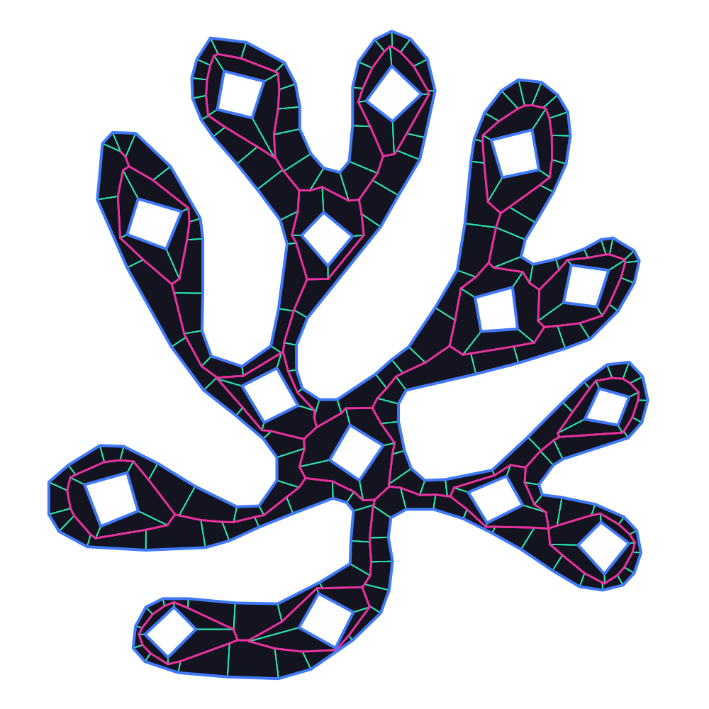
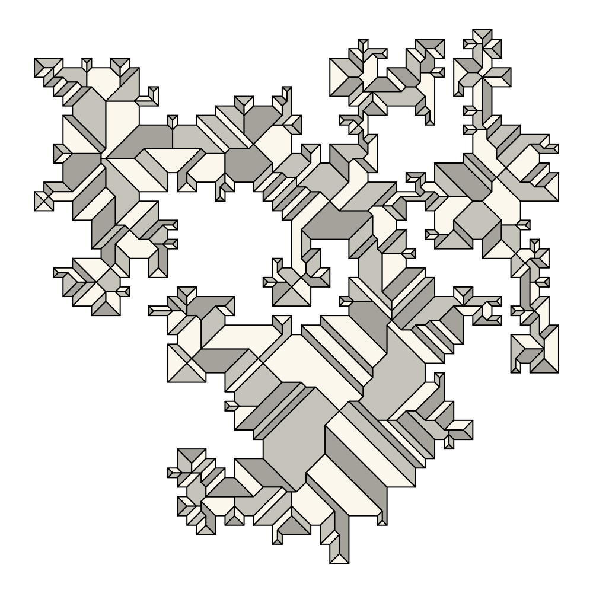
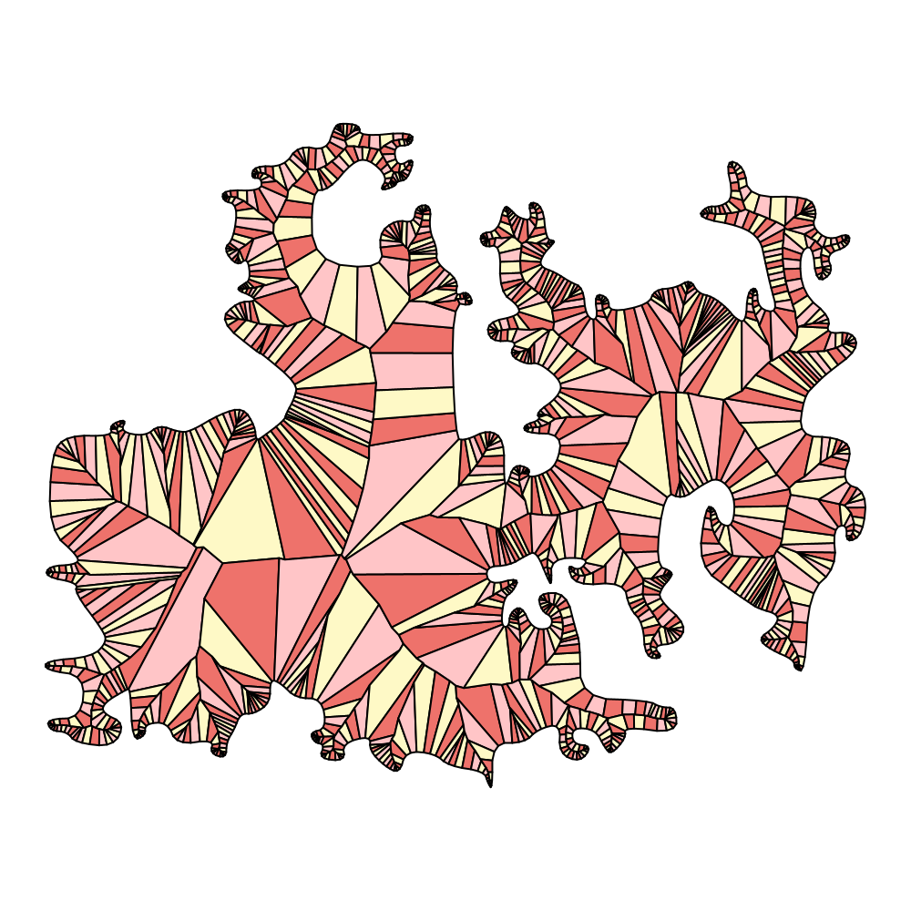

[](https://jitpack.io/#micycle1/grassfire4j)

# grassfire4j

A kinetic straight‑skeleton (wavefront‑collapse / “grassfire”) implementation in Java.

## Overview

### What is a straight skeleton?
The straight skeleton of a polygon is the set of line segments traced by the polygon’s vertices as the boundary is offset inward at uniform speed (the “wavefront” or “grassfire” process). Each edge moves parallel to itself; wavefront vertices follow the bisectors of their incident angles. The union of these vertex trajectories forms an embedded graph inside the polygon: the straight skeleton.

### Kinetic approach
`grassfire4j` implements the triangulation + kinetic event-queue algorithm of Aichholzer & Aurenhammer[^1]. It maintains a constrained triangulation of the region not yet swept by the wavefront while all wavefront vertices move linearly in time. For each triangle, the signed area is a quadratic function of time, so the time at which the triangle collapses can be obtained directly from the polynomial’s roots. Each collapse triggers a local topological update (e.g., flip, split, edge). These events are inserted into a priority queue and processed in increasing time order, advancing the wavefront and incrementally building the straight skeleton.

### Project
This project is the first full kinetic straight‑skeleton implementation available in Java. Compared to the other notable Java implementation, [campskeleton](https://github.com/twak/campskeleton), which uses Felkel’s edge‑collision approach, `grassfire4j` follows the triangulation‑based kinetic method described above. In practice this is more robust and significantly faster.

The core algorithm is derived from a Python [implementation](https://github.com/bmmeijers/grassfire) by bmmeijers. I [forked](https://github.com/micycle1/grassfire2) that project to re‑architect and improve it (drawing on ideas from the academic [surfer2](https://github.com/cgalab/surfer2) C++ project), then ported and adapted the fork to Java.

## Features
- Pure-Java kinetic (wavefront-collapse) straight skeleton.
- Accepts JTS `Polygon` inputs, including holes.
- Supports per-edge weights.
- Outputs a `Skeleton` model (nodes, kinetic vertices, segments) suitable for visualisation or export.
- Skeleton coordinates include a `.z` time/height component (useful for extrusion, i.e. rooftops).
- Adapter-based input pipeline (`InputMesh`) for plugging in custom inputs.

## Usage

### Example

```java
WKTReader reader = new WKTReader();
Polygon polygon = (Polygon) reader.read(
		"POLYGON ((0 0, 20 0, 20 10, 10 10, 10 20, 0 20, 0 0))");

var skeleton = Grassfire.computeSkeleton(polygon);
MultiLineString bones = skeleton.asMultiLineString();

System.out.println(bones.toText());
```

### Maven / Gradle
grassfire4j is available for Maven / Gradle via [JitPack](https://jitpack.io/#micycle1/grassfire4j).

## Illustrations

<p align="center">
  
</p>

[^1]: https://dl.acm.org/doi/10.5555/646715.701578
